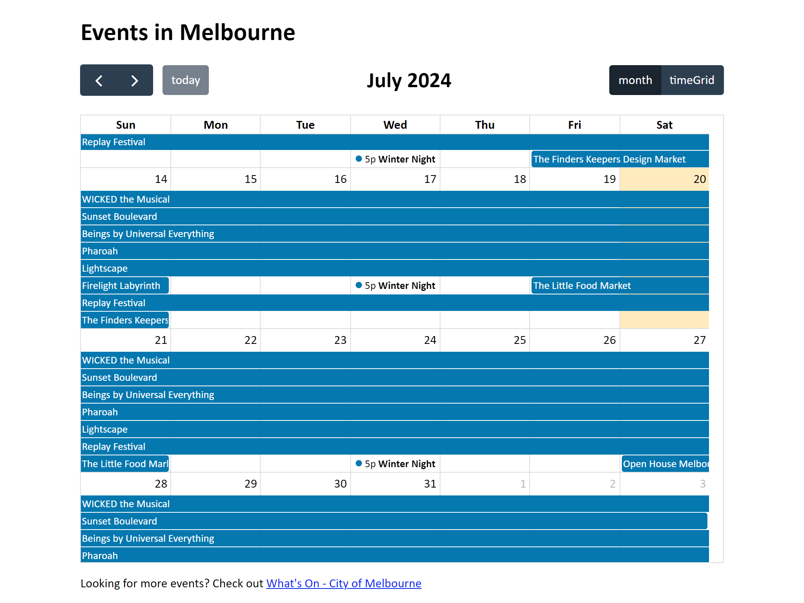

# Melbourne Events

Hosted at https://pakkudon.github.io/melbourne-events/



A calendar displaying upcoming events in Melbourne, Victoria.

This site was built using [FullCalendar](https://fullcalendar.io/).

## Development

### Pre-requisites

- Node (Built using v22 but may work with earlier versions)

### Local development

```sh
# Install dependencies
npm i

# Start local development server
npm run dev

# Format code using Prettier
npm run format
```

### Deployment

Changes pushed to `main` are automatically deployed to Github Pages. This is done via a workflow which is defined in [.github/workflows/deploy.yml](.github/workflows/deploy.yml).

### Add / update events

- Event data is stored in JSON files in [`data/`](data/)
- Events are grouped by year and stored in chronological order by their start date
- To add a new event add an event object to the `events` array in the corresponding data file
